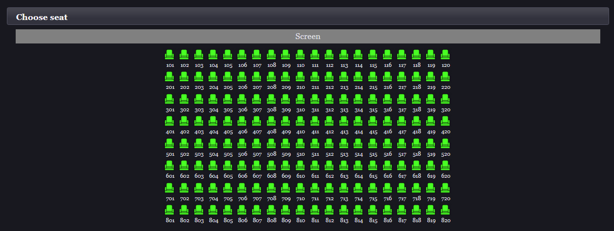

# Cinema Reservation System
I made this app when I was learning about [Spring](http://spring.io). It makes use of [Spring MVC](https://docs.spring.io/spring/docs/current/spring-framework-reference/web.html), [Spring Security](https://projects.spring.io/spring-security/), [Hibernate](http://hibernate.org/), [Thymeleaf](https://www.thymeleaf.org) and [Primefaces](https://www.primefaces.org/). It has many flaws so I want to rewrite it, add tests, make it RESTful and consume it using [Angular](https://angular.io), [React](https://reactjs.org/) or [Vue](https://vuejs.org/).

## Overview
Main target of this app is to allow its users to buy tickets for screenings in cinema using web browser. Users can also choose which seat they want to take during their screening. We also have an admin and employee panel which allows us to add new screenings/movies and manage user accounts. Admin account can add/modify movies list which then can be used by employees to create screenings.

## Class diagram

## Example images
### User perspective

### Admin perspective

### Employee perspective

